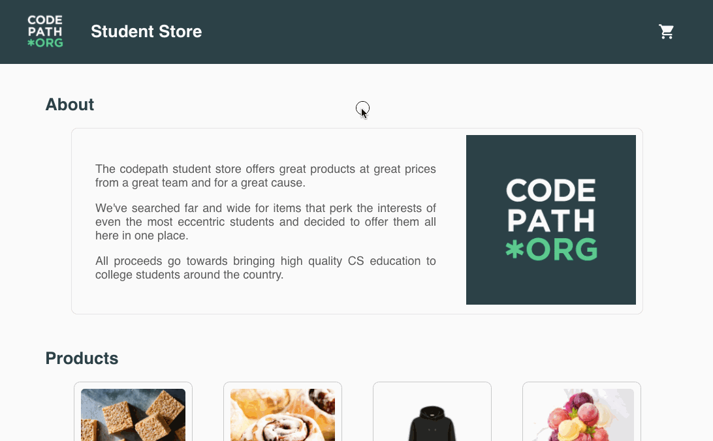
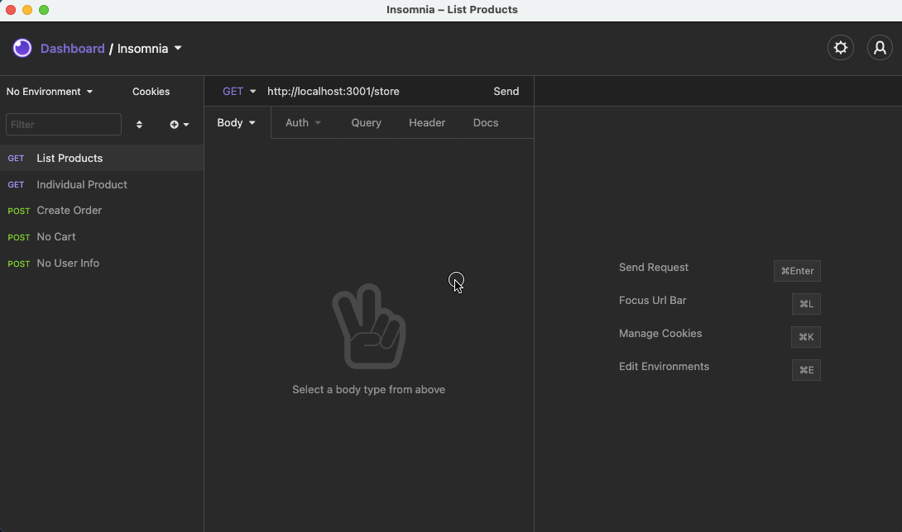

## Week 2 Assignment: Student Store

Submitted by: **Stephanie De Leon**

Estimated time spent: **13.5** hours spent in total

### Application Features

#### CORE FEATURES

- [x] The API should contain an endpoint that serves an array of all products in the store
- [x] A Store model should handle all data management logic for the API and be the interface for read/write operations to the JSON file.
- [x] The frontend should include a landing page that displays the products available for purchase.
- [x] Each product should have an individual page that shows the details of the product.

#### STRETCH FEATURES

- [x] An endpoint should exist for creating orders and saving them to a JSON file. Each order should contain the email of the person placing the order, the items associated with the order, and the quantity of each item purchased.
- [x] Create an endpoint that serves only a single product based on the product's id
- [ ] Deploy your website with Heroku & Surge. 
- [ ] There should be a `Sidebar` component that appears on every page and has two states - `open` and `closed`. When the sidebar is opened, it should display a shopping cart of all the products the user currently has in their cart. It should also calculate and display the total amount in dollars for the checked-out items. When it's closed, the sidebar should be much thinner and not display its internal content.
- [ ] A checkout form should be available that allows the user to enter their email and send their order to the API.
- [ ] Create an endpoint for fetching all orders in the database, and an endpoint for serving an individual order based on its id.
- [ ] Build a page in the UI that displays the list of all past orders and lets the user click on any individual order to take them to a more detailed page of the transaction.
- [ ] Allow users to use an input to filter orders by the email of the person who placed the order.

### Walkthrough Video

Student Store Demo - Frontend | 
:-------------------------:
  |

Student Store Demo - Backend | 
:-------------------------:
  |

### Reflection

* Did the topics discussed in your labs prepare you to complete the assignment? Be specific, which features in your weekly assignment did you feel unprepared to complete?

  - Yes, the topics discussed in the labs prepared me to complete the assignment. From learning about Node, Express to React. Although, the feature of adding to cart automatically as add and subtract buttons were pressed were never discussed.

* If you had more time, what would you have done differently? Would you have added additional features? Changed the way your project responded to a particular event, etc.
  
  - If I had more time, I would definitely add the cart feature, wherein as customers press add and remove buttons for the items, it would automatically add to their cart and compute the total for them. I would also have the quantity persist not only in home page but also on the product details page as the customer clicks on a product for more details. In the product details page, I would also love for the customer to be able to add to their cart there too. Lastly, I would implement the feature where customers can submit their orders, by giving their name and email, and it would then be saved and sent to the API.
  
* Reflect on your project demo, what went well? Were there things that maybe didn't go as planned? Did you notice something that your peer did that you would like to try next time?

  - In my project demo, fortunately, I was able to demonstrate all the core features and everything did go as planned. Although, I would have wanted to show stretch features such as the cart feature but I lacked the time to work on it. From my peer's demo, I noticed some had functioning nav bars and it would take them back to the home page from product details page. They also had the sidebar feature which I thought was very cool! 

### Open-source libraries used

- https://fonts.googleapis.com/icon?family=Material+Icons for the icons used.

### Shout out

- Shoutout to Paige and Tirumari for teaching us Node, Express, and react; and to Robert, Diego, and Sharon for being amazing people to work with and for giving me feedback!
